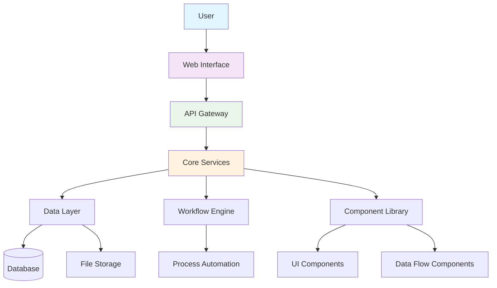
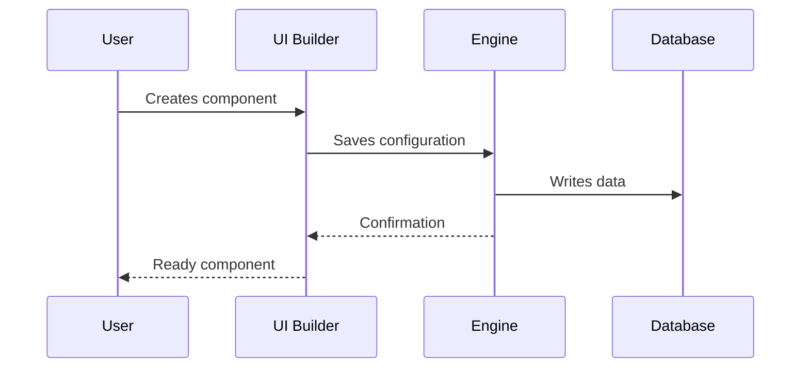
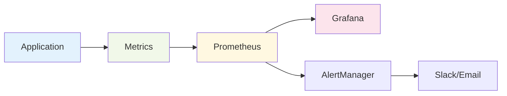

# Aqtra Platform Architecture

Overview of Aqtra platform architecture and main system components.

## General Scheme

## System Components

### Core Modules

| Module              | Description           | Status                                    |
| ------------------- | --------------------- | ----------------------------------------- |
| **Core Engine**     | Platform Core         | Active         |
| **UI Builder**      | Interface Constructor | Active         |
| **Workflow Engine** | Process Engine        | Active         |
| **Data Flow**       | Data Processing       | Active         |
| **Python Runtime**  | Python Code Execution | In Development |

### Technology Stack

=== "Backend"
`python
    # Core Technologies
    - Python 3.11+
    - FastAPI
    - PostgreSQL
    - Redis
    - Celery
    `

=== "Frontend"
`javascript
    // Client Technologies
    - React 18
    - TypeScript
    - Material-UI
    - Redux Toolkit
    `

=== "DevOps"
`yaml
    # Infrastructure
    - Docker
    - Kubernetes
    - Nginx
    - Prometheus
    `

## Development Process

## Security

!!! warning "Important"
All data is encrypted during transmission and storage. TLS 1.3 is used for all connections.

!!! danger "Limitations"
Do not store passwords in plain text. Use the built-in authentication system.

## Performance

- **Response Time**: < 200ms for standard operations
- **Throughput**: up to 10,000 requests/sec
- **Scalability**: horizontal scaling
- **Availability**: 99.9% uptime

## Monitoring

---

  <a class="btn" href="/app-development/">Start Development</a>
  <a class="btn" href="/tutorials/">Explore Tutorials</a>

