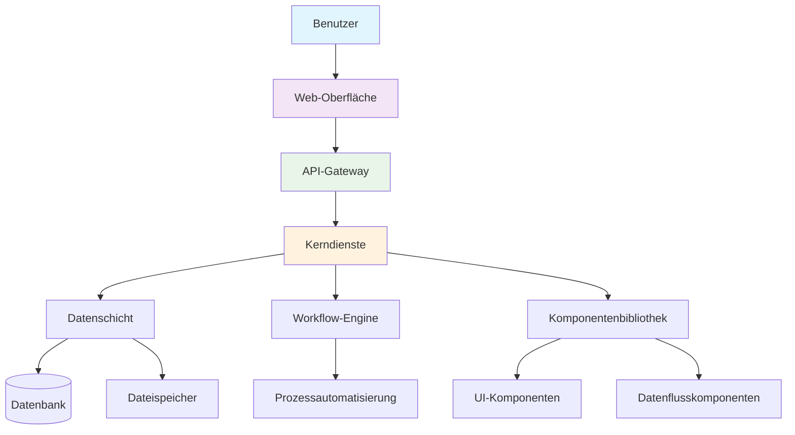
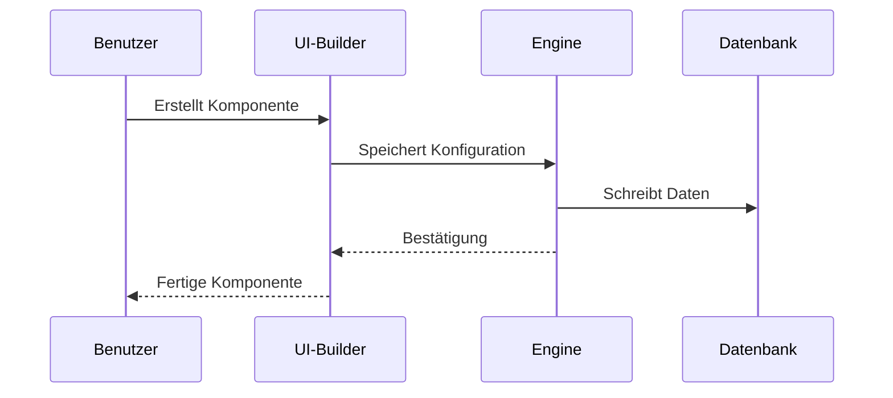
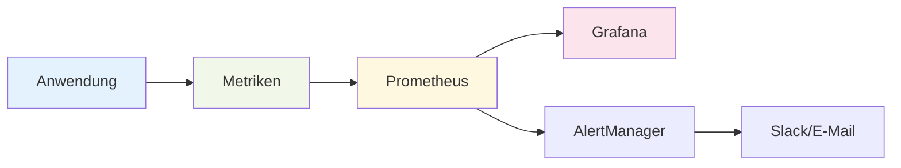

# Aqtra-Plattform-Architektur

Überblick über die Aqtra-Plattform-Architektur und die wichtigsten Systemkomponenten.

## Allgemeines Schema

## Systemkomponenten

### Kernmodule

| Modul               | Beschreibung              | Status                                    |
| ------------------- | ------------------------- | ----------------------------------------- |
| **Core Engine**     | Plattformkern             | Aktiv          |
| **UI Builder**      | Schnittstellenkonstruktor | Aktiv          |
| **Workflow Engine** | Prozess-Engine            | Aktiv          |
| **Data Flow**       | Datenverarbeitung         | Aktiv          |
| **Python Runtime**  | Python-Code-Ausführung    | In Entwicklung |

### Technologie-Stack

=== "Backend"
`python
    # Kerntechnologien
    - Python 3.11+
    - FastAPI
    - PostgreSQL
    - Redis
    - Celery
    `

=== "Frontend"
`javascript
    // Client-Technologien
    - React 18
    - TypeScript
    - Material-UI
    - Redux Toolkit
    `

=== "DevOps"
`yaml
    # Infrastruktur
    - Docker
    - Kubernetes
    - Nginx
    - Prometheus
    `

## Entwicklungsprozess

## Sicherheit

!!! warning "Wichtig"
Alle Daten werden während der Übertragung und Speicherung verschlüsselt. TLS 1.3 wird für alle Verbindungen verwendet.

!!! danger "Einschränkungen"
Speichern Sie keine Passwörter im Klartext. Verwenden Sie das integrierte Authentifizierungssystem.

## Leistung

- **Antwortzeit**: < 200ms für Standardoperationen
- **Durchsatz**: bis zu 10.000 Anfragen/Sek.
- **Skalierbarkeit**: horizontale Skalierung
- **Verfügbarkeit**: 99,9% Betriebszeit

## Überwachung

---

  <a class="btn" href="/app-development/">Entwicklung starten</a>
  <a class="btn" href="/tutorials/">Tutorials erkunden</a>

