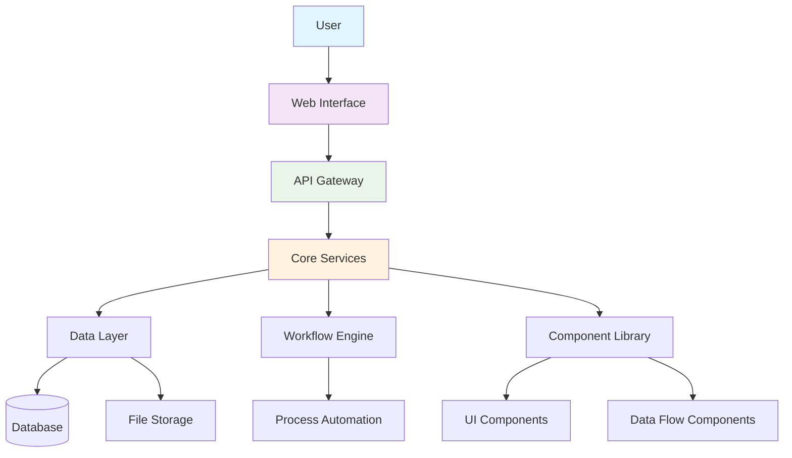
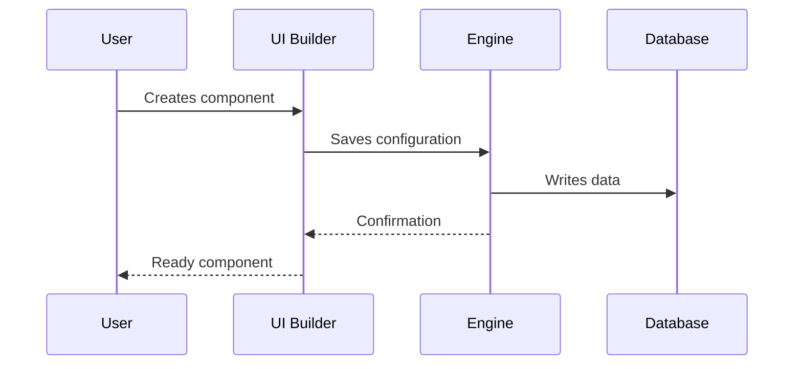
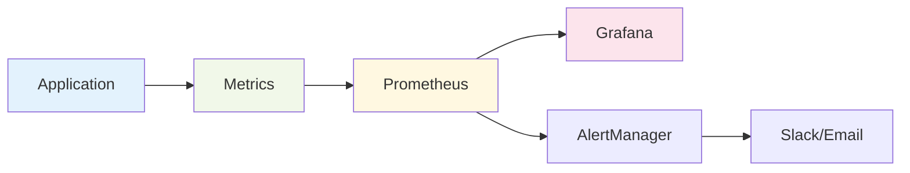

# Arquitectura de la Plataforma Aqtra

Descripción general de la arquitectura de la plataforma Aqtra y los principales componentes del sistema.

## Esquema General

## Componentes del Sistema

### Módulos Principales

| Módulo              | Descripción           | Estado                                    |
| ------------------- | --------------------- | ----------------------------------------- |
| **Motor Principal** | Núcleo de la Plataforma| Activo         |
| **Constructor de UI**| Constructor de Interfaz| Activo         |
| **Motor de Flujo de Trabajo** | Motor de Procesos | Activo         |
| **Flujo de Datos**  | Procesamiento de Datos| Activo         |
| **Entorno de Python**| Ejecución de Código Python | En Desarrollo |

### Stack Tecnológico

=== "Backend"
`python
    # Tecnologías Principales
    - Python 3.11+
    - FastAPI
    - PostgreSQL
    - Redis
    - Celery
    `

=== "Frontend"
`javascript
    // Tecnologías del Cliente
    - React 18
    - TypeScript
    - Material-UI
    - Redux Toolkit
    `

=== "DevOps"
`yaml
    # Infraestructura
    - Docker
    - Kubernetes
    - Nginx
    - Prometheus
    `

## Proceso de Desarrollo

## Seguridad

!!! warning "Importante"
Todos los datos están encriptados durante la transmisión y el almacenamiento. Se utiliza TLS 1.3 para todas las conexiones.

!!! danger "Limitaciones"
No almacene contraseñas en texto plano. Utilice el sistema de autenticación integrado.

## Rendimiento

- **Tiempo de Respuesta**: < 200ms para operaciones estándar
- **Rendimiento**: hasta 10,000 solicitudes/segundo
- **Escalabilidad**: escalado horizontal
- **Disponibilidad**: 99.9% de tiempo de actividad

## Monitoreo

---

  <a class="btn" href="/es/app-development/">Iniciar Desarrollo</a>
  <a class="btn" href="/es/tutorials/">Explorar Tutoriales</a>

