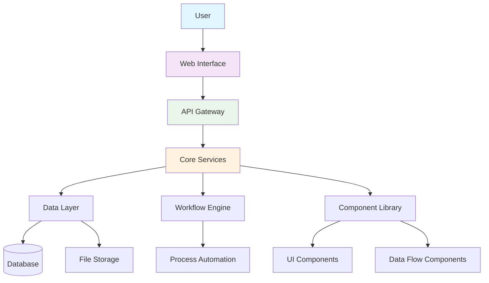
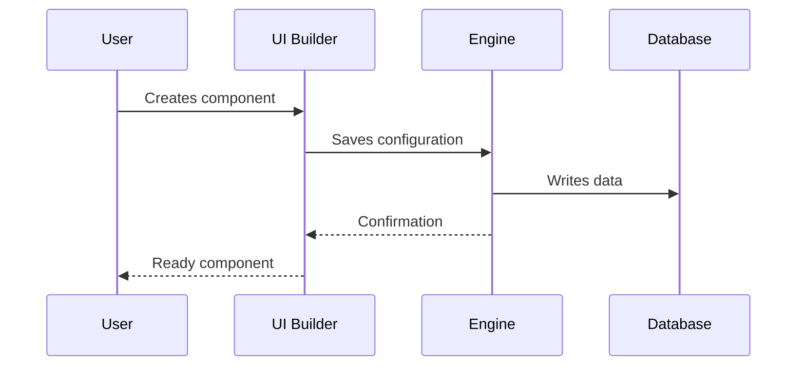
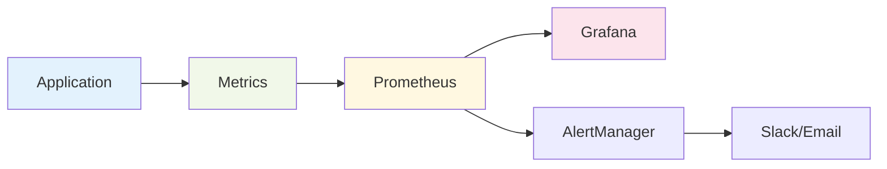

# Architecture de la plateforme Aqtra

Aperçu de l'architecture de la plateforme Aqtra et des principaux composants du système.

## Schéma Général

## Composants du Système

### Modules Principaux

| Module              | Description           | Statut                                    |
| ------------------- | --------------------- | ----------------------------------------- |
| **Moteur Principal** | Noyau de la plateforme | Actif         |
| **Constructeur UI**  | Constructeur d'interface | Actif         |
| **Moteur de Workflow** | Moteur de processus  | Actif         |
| **Flux de Données**  | Traitement des données | Actif         |
| **Runtime Python**   | Exécution de code Python | En développement |

### Pile Technologique

=== "Backend"
`python
    # Technologies de base
    - Python 3.11+
    - FastAPI
    - PostgreSQL
    - Redis
    - Celery
    `

=== "Frontend"
`javascript
    // Technologies client
    - React 18
    - TypeScript
    - Material-UI
    - Redux Toolkit
    `

=== "DevOps"
`yaml
    # Infrastructure
    - Docker
    - Kubernetes
    - Nginx
    - Prometheus
    `

## Processus de Développement

## Sécurité

!!! warning "Important"
Toutes les données sont cryptées pendant la transmission et le stockage. TLS 1.3 est utilisé pour toutes les connexions.

!!! danger "Limitations"
Ne stockez pas les mots de passe en texte clair. Utilisez le système d'authentification intégré.

## Performance

- **Temps de Réponse** : < 200ms pour les opérations standard
- **Débit** : jusqu'à 10 000 requêtes/sec
- **Scalabilité** : scalabilité horizontale
- **Disponibilité** : 99,9% de temps de fonctionnement

## Surveillance

---

  <a class="btn" href="/fr/app-development/">Commencer le développement</a>
  <a class="btn" href="/fr/tutorials/">Explorer les tutoriels</a>

