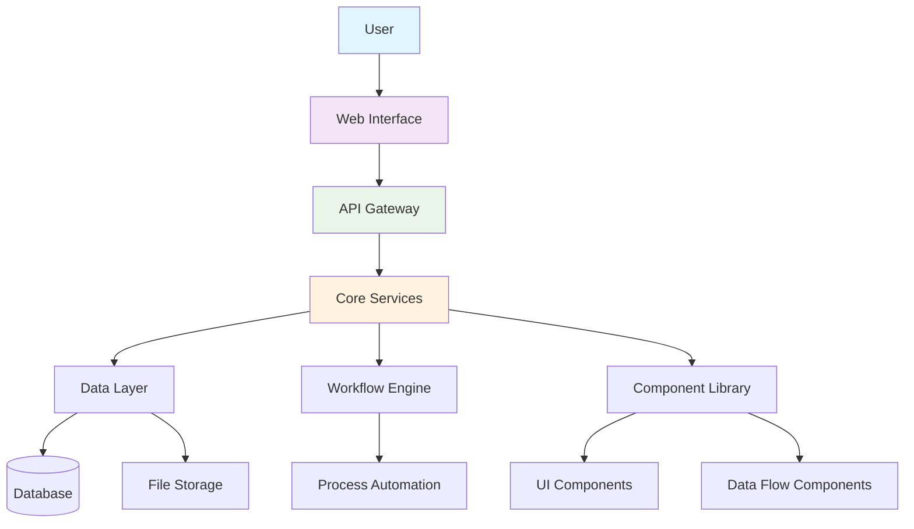
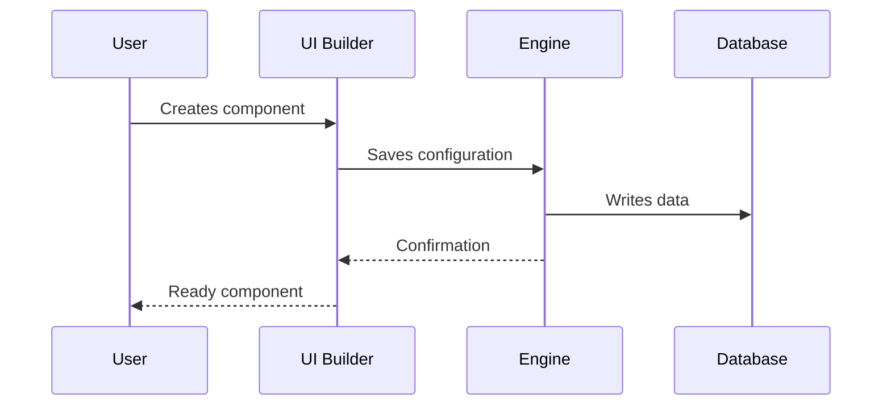
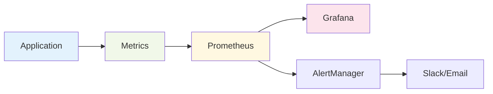

# Arquitetura da Plataforma Aqtra

Visão geral da arquitetura da plataforma Aqtra e dos principais componentes do sistema.

## Esquema Geral

## Componentes do Sistema

### Módulos Principais

| Módulo              | Descrição            | Status                                    |
| ------------------- | --------------------- | ----------------------------------------- |
| **Core Engine**     | Núcleo da Plataforma  | Ativo         |
| **UI Builder**      | Construtor de Interface| Ativo         |
| **Workflow Engine** | Motor de Processos    | Ativo         |
| **Data Flow**       | Processamento de Dados| Ativo         |
| **Python Runtime**  | Execução de Código Python| Em Desenvolvimento |

### Stack Tecnológica

=== "Backend"
`python
    # Tecnologias Principais
    - Python 3.11+
    - FastAPI
    - PostgreSQL
    - Redis
    - Celery
    `

=== "Frontend"
`javascript
    // Tecnologias do Cliente
    - React 18
    - TypeScript
    - Material-UI
    - Redux Toolkit
    `

=== "DevOps"
`yaml
    # Infraestrutura
    - Docker
    - Kubernetes
    - Nginx
    - Prometheus
    `

## Processo de Desenvolvimento

## Segurança

!!! warning "Importante"
Todos os dados são criptografados durante a transmissão e o armazenamento. TLS 1.3 é utilizado para todas as conexões.

!!! danger "Limitações"
Não armazene senhas em texto simples. Utilize o sistema de autenticação embutido.

## Desempenho

- **Tempo de Resposta**: < 200ms para operações padrão
- **Taxa de Transferência**: até 10.000 requisições/segundo
- **Escalabilidade**: escalabilidade horizontal
- **Disponibilidade**: 99,9% de tempo de atividade

## Monitoramento

---

  <a class="btn" href="/pt/app-development/">Iniciar Desenvolvimento</a>
  <a class="btn" href="/pt/tutorials/">Explorar Tutoriais</a>

